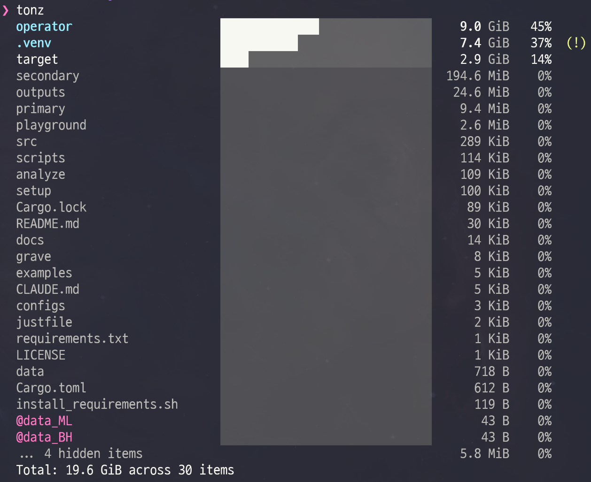

# tonz

**See what's heavy.** A modern, fast disk usage viewer for the terminal.

[](https://github.com/Axect/tonz/actions)
[](https://crates.io/crates/tonz)
[](LICENSE)



**1.8x faster than dust** &middot; **~900 KiB binary** &middot; **TTY + JSON + Pipe**

```sh
cargo install tonz
```

---

## Why tonz?

```bash
# The old way
du -sh * | sort -hr | head -n 10

# The tonz way
tonz
```

One command. Sorted by size. Proportional bars. Semantic coloring. Done.

## Features

- **Fast** &mdash; Parallel scanning via [Rayon](https://github.com/rayon-rs/rayon), 1.8x faster than dust on typical workloads
- **Readable** &mdash; Clean columnar output with proportional bars and 3-level semantic coloring
- **Smart hidden files** &mdash; Hidden items aggregated by default; large ones (>5%) auto-promoted with `(!)` marker
- **Symlink-aware** &mdash; Symlinks shown with `@` prefix in magenta, clearly distinguished from regular files
- **Unix-friendly** &mdash; TTY mode for humans, raw TSV for pipes, `--json` for scripts. Respects `NO_COLOR`
- **Safe** &mdash; Single-filesystem by default. Hardlink deduplication. Memory guard for huge directories
- **Tiny** &mdash; ~900 KiB stripped binary

## Comparison

| Feature | tonz | dust | dua | ncdu | gdu |
|---------|:----:|:----:|:---:|:----:|:---:|
| Parallel scan | **Yes** | Yes | Yes | No | Yes |
| Proportional bars | **Yes** | Yes | No | Yes | Yes |
| Semantic coloring | **3-level** | No | No | No | Basic |
| Hidden file aggregation | **Auto** | No | No | No | No |
| Symlink detection | **@prefix** | No | No | No | No |
| JSON output | **Yes** | No | No | No | Yes |
| Pipe-friendly (TSV) | **Yes** | No | No | No | No |
| Hardlink dedup | **Yes** | No | No | Yes | No |
| Single binary size | **~900 KiB** | ~2 MiB | ~1 MiB | ~300 KiB | ~5 MiB |

## Install

### From crates.io

```sh
cargo install tonz
```

### From source

```sh
git clone https://github.com/Axect/tonz.git
cd tonz
cargo build --release
# Binary at target/release/tonz
```

### Pre-built binaries

Download from [GitHub Releases](https://github.com/Axect/tonz/releases) for Linux (x86_64, aarch64) and macOS (x86_64, Apple Silicon).

## Usage

```
tonz [PATH] [OPTIONS]
```

| Flag | Description |
|------|-------------|
| `-H`, `--hidden` | Show all hidden files and directories |
| `--json` | Output as line-delimited JSON |
| `--sparkline` | Use compact sparkline visualization |
| `-j`, `--jobs <N>` | Number of threads (default: auto) |
| `--across-mounts` | Cross filesystem boundaries |
| `--no-color` | Disable colors |

### Examples

```sh
tonz                        # Current directory
tonz /var/log               # Specific path
tonz -H ~                   # Show hidden files
tonz ~ | sort -rn | head -5 # Pipe to other tools
tonz --json ~/projects      # JSON for scripting
```

## Output Modes

**TTY** (default when connected to a terminal):
```
  Documents       ████████████████████░░░░   4.2 GiB  38%
  .cache          ██████████░░░░░░░░░░░░░░   2.1 GiB  19%  (!)
  @my_symlink     ░░░░░░░░░░░░░░░░░░░░░░░░      43 B   0%
```

**Pipe** (when piped to another command):
```
4509715456	Documents
1932735283	Downloads
```

**JSON** (`--json`):
```json
{"name":"Documents","size":4509715456,"is_dir":true,"is_hidden":false,"is_estimate":false,"is_symlink":false,"percentage":38.2}
```

<details>
<summary><strong>How it works</strong></summary>

tonz uses a **4-phase scanner pipeline**:

1. **Classify** &mdash; Read immediate children, check filesystem boundaries, detect symlinks
2. **Parallel Scan** &mdash; Rayon work-stealing traversal per subdirectory with hardlink dedup
3. **Merge** &mdash; Aggregate sizes, errors, and estimate flags
4. **Render** &mdash; TTY/Pipe/JSON output with proportional bar visualization

The depth-1-only design is both a UX and performance decision: no tree construction means minimal allocation and sub-second results even on large directories.

</details>

> [!TIP]
> tonz stays on a single filesystem by default. Running `tonz /` won't accidentally traverse network mounts or slow external drives. Use `--across-mounts` to opt in.

## License

MIT
